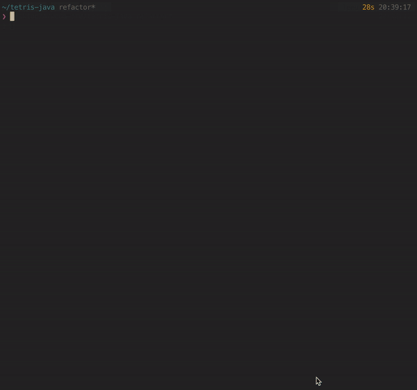

# TETRIS

terminal tetris implemented in java

---


## 지원

Only Tested on Mac OS X mojave

## Installation

---

```sh
git clone https://github.com/2012monk/tetris
cd tetris
./gradlew install
```

run

```sh
./tetris
```

link global

```sh
./gradlew link
```

unlink

```sh
./gradlew unlink
```

## TODO

- 크로스 플랫폼 지원
- 화면이 가끔씩 밀려서 갱신되는 버그 수정
- 반응성 개선

## features

- bgm
- in game score board
- preview next block
- local score board
- block counter

## UI

### 게임 화면

- [x] game board
- [x] score board
- [x] next block notification
- [x] timer
- [x] game over screen
- [x] leader board
- [x] block counter

## function list

### menu select

- [x] play
- [x] score board
- [x] quit

### user input

- [x] get single char
- [x] get arrow input
- [x] down, up, rotate, force drop
- [x] pause
- [x] quit

### print

- [x] refresh board
- [x] print single block
- [x] print board
- [x] print blocks in different color

### tetris

- [x] drop a block at a specified speed
- [x] move block left, right
- [x] rotate block
- [x] wall kick
- [x] collision detection
- [ ] complete row effect
- [x] game end condition check

## Console Management (TUI)

JNI 를 이용한 ncurses 라이브러리를 통해 터미널 제어

jcurses 라이브러리 참고

- [x] create new window
- [x] non blocking input handle
- [x] paint border
- [x] move window position
